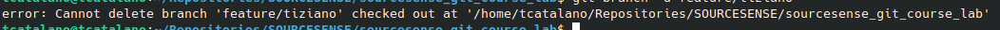

1. Eliminare il branch precedentemente creato (attemzione all'eventuale errore che vi può comparire nello stdout)
```
Nel caso siate depositati sul branch da eliminare potrebbe comparirvi un errore come in figura02. Questo significa che non potete eliminare un branch sul quale state lavorando. Per eliminarlo, quindi, bisogna effettuare un checkout su un altro branch e poi procedere alla cancellazione del branch in esame.
Ovvero:
- git checkout main
- git branch -d feature/\<mio-nome\> 
```

2. Ricreare nuovamente ilbranch 'feaure/\<mio-nome\>'
```
git branch feature/<mio-nome>
```
3. Pushare il branch creato nel punto 2 verso repository remota
```
git push origin feature/<mio-nome>
```