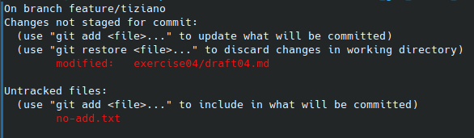

1. Creare il file ```.gitignore```
```
$ vi .gitignore
```

2. Creare un altro file chiamato ```no-add.txt```
```
$ vi no-add.txt
```

3. Verificare lo stato della repository
```
$ git status
```


4. Aggiungere all'indice solo il file ```.gitignore```.
```
$ git add .gitignore
```

5. Verificare lo stato della repository
```
$ git status
```


6. Commitare lo stato attuale delll'indice con il messaggio "gitignore"
```
$ git commit -m "gitignore"
```

7. Verificare lo stato della repository
```
$ git status
```

