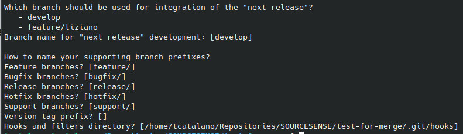
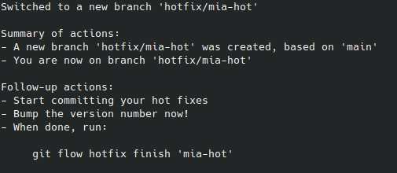

1. Installare ```git-flow```
```
Potete seguire questa guida: https://devdev.it/guida-gitflow/installazione-configurazione-gitflow/ 
```

2. Inizializzare una repo con ```git-flow``` (stando attenti alla configurazione interattiva)
```
$ git-flow init
```


3. provate ad aprire una hotfix partendo dal branch di sviluppo (verificate l'output). Preferibilmente per evitare incomprensione fate in modo che il branch di ```develop``` sia un commit avanti al ```main``` 
```
$ git checkout develop
$ git-flow hotfix start <nome-della-hotfix>
```
